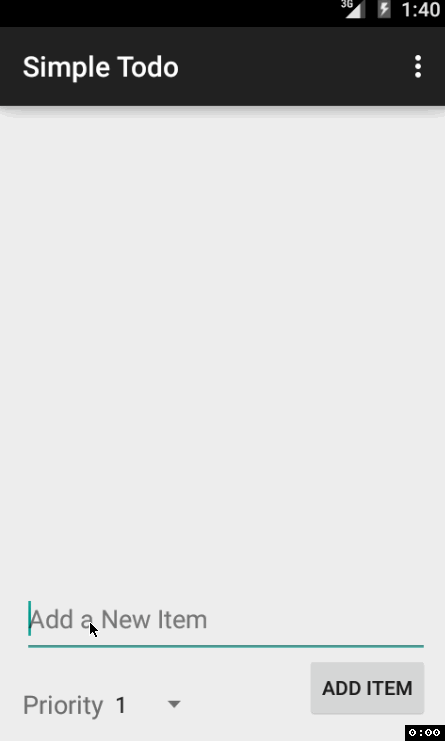

# Simple Todo App
This ia a simple TODO app for Android to help get a handle on basic concepts in Android development.

Time spent: 4 days with ~ 3 hours each day. 

Areas which consumed time: Sorting the UI with the differnt layouts, understanding fragments, understanding the SQLite Helper class and usage. 

User stories:
 * [x] User can add todo items with a priority attached to them. Supporting multiline as well.
 * [x] User can delete an item by long pressing it and confirming deletion. 
 * [x] User can edit an item by clicking it and making the changed in a dialog fragment. 

Final appilcation supports SQLite for data and priorities for items. The DB is set up for due dates and completed marks as well but is not supported yet. 

Tried using fragments in several ways (interfaces and builder, etc...) to experiment the different ways to do so. 

GIF created with [LiceCap](http://www.cockos.com/licecap/).

